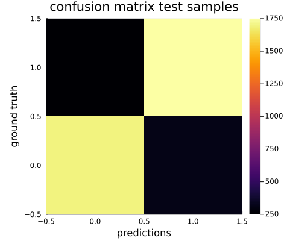
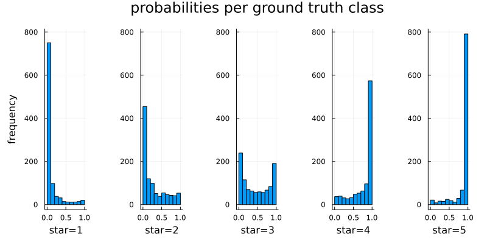
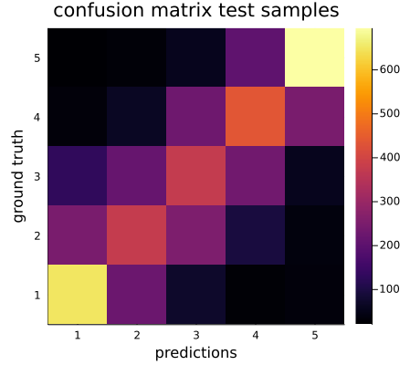
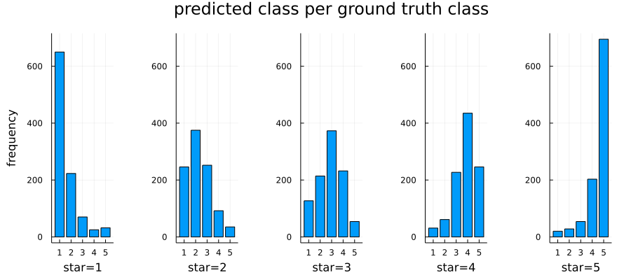

# TransformersLite

A basic transformer package. This is meant to be for learning. For a much more comprehensive package with CUDA support, APIs for HuggingFace, optimizations and more, please see Transformers.jl at [github.com/chengchingwen/Transformers.jl](https://github.com/chengchingwen/Transformers.jl).

This package is designed to work with `Flux`. It provides a multi-head attention layer as described in the paper [Attention is all you need](https://arxiv.org/abs/1706.03762).
It also provides a simple index tokenizer, a wrapper for an embedding layer, a wrapper for a mean layer, a position encoding layer
and two encompassing layers to chain these together: `TransformerEncoderBlock` and `TransformerClassifier`. 
Flux's `chain` function can also be used to chain the layers together.

Two implementations are provided for the 4D batch multiplication such at `A×B` results in `C[:,:,k,l] == A[:,:,k,l] * B[:,:,k,l]`.
These are `mul4d` and an extension to NNlib's `batched_mul`. Of the two `batched_mul` is about 1.5× faster.

An example model output looks like:
```
TransformerClassifier(
     Embed(32, 7455),                   # 238_560 parameters
     PositionEncoding(32),
     TransformerEncoderBlock(
          MultiheadAttention(num_heads=4, head_size=8, 32=>32)(
               denseQ = Dense(32 => 32),  # 1_056 parameters
               denseK = Dense(32 => 32),  # 1_056 parameters
               denseV = Dense(32 => 32),  # 1_056 parameters
               denseO = Dense(32 => 32),  # 1_056 parameters
          )
          LayerNorm(32),                # 64 parameters
          Dense(32 => 128, relu),       # 4_224 parameters
          Dense(128 => 32),             # 4_128 parameters
          LayerNorm(32),                # 64 parameters
     )     MeanLayer(),
     Dense(50 => 5),                    # 255 parameters
)                  # Total: 19 arrays, 251_519 parameters, 1.083 Mi
```
Please see the `example` folder for utility functions, notebooks and training script which demonstrate the Module's capabilities.
These examples use tokenizers from my TokenizersLite repository at [https://github.com/LiorSinai/TokenizersLite](https://github.com/LiorSinai/TokenizersLite).
However any compatible tokenizer can be used.

## Case study

A simple use case of Amazon Reviews from [HuggingFace](https://huggingface.co/datasets/amazon_reviews_multi) was investigated.
The task was given a text input to predict the star rating. 
A similar task was also investigated to predict a positive or negative sentiment with 1-2 stars labelled negative, 4-5 stars labelled positive and 3 stars removed. Only the English subset of the dataset was used with 200,000 training samples and 5,000 test samples.

It should be noted that this task can be solved with simpler models. A TFIDF model paired with logistic regression (≈ 10,000 weights)
achieved similar accuracy to these models with more than 240,000 weights.

The accuracy achieved on the test data was 86.7% for the binary task and 50.5% for the 5 star classification  task.



The confusion matrix shows that the binary model does indeed mostly predict the correct class.




The probabilities for each star are strongly biased in the right way, with 1 star ratings being mostly negative and 5 star ratings mostly positive. The model was not trained on 3 star reviews so here the distribution is almost uniform (random) with a slight negative skew. However this may also be a reflection of the underlying data because humans are not consistent with their ratings for 3 stars. 



Looking at the confusion matrix for the 5 star classification, we can see that the model again struggles more with the middle ratings of 2-4.
Again this is hypothesized  to be partially because of the underlying data.



Seeing in another view as a bar chart, for each star the most likely prediction is the star itself.
However the distributions do have a spread and leave significant overlap for confusion.

## Installation

Download the GitHub repository (it is not registered). Then in the Julia repl:
```
julia> ] #enter package mode
(@v1.x) pkg> dev path\\to\\TransformersLite
```

Done. 